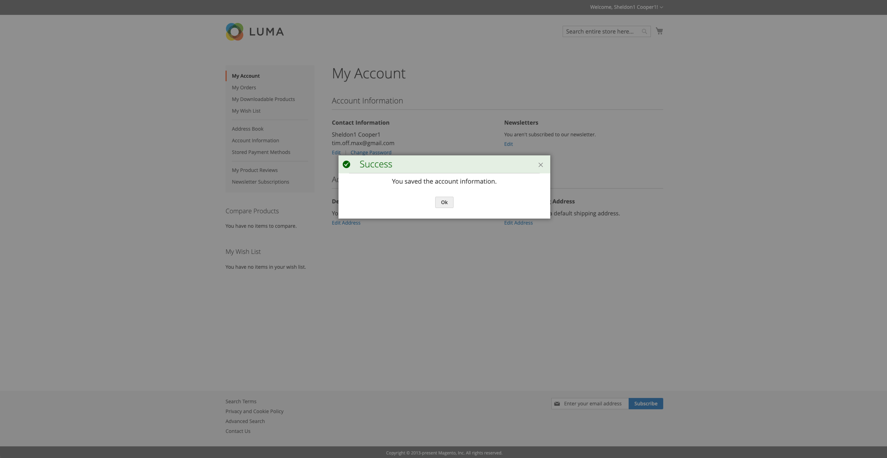

# About the module
The module allows us to use popups to display notification messages. 
It works for both: frontend and admin areas. 

It also is quite flexible. For instance, you can use it only for displaying error messages for admins and keep all the other notifications displaying in the standard way. Furthermore, you don't have to replace standard notifications at all, just use it for custom-defined messages in places you need it.

# Main features
- Adding a custom popup notification is the frontend area with a single line of code, the same way you do it for the standard Magento notifications
- Adding a custom popup notification is the admin area with a single line of code, the same way you do it for the standard Magento notifications
- Displaying popup notifications on success/error AJAX responses in the admin area (for custom AJAX grids and forms)
- Allowing using certain HTML tags in the notification text: `div`, `span`, `b`, `strong`, `i`, `em`, `u`, `a`, `br` 
- `OPTIONAL` Replacing all the standard notifications in the frontend area
  - Success notifications (turn it on/off at any moment)
  - Error notifications (turn it on/off at any moment)
  - Warning notifications (turn it on/off at any moment)
  - Notice notifications (turn it on/off at any moment)
- `OPTIONAL` Replacing all the standard notifications in the admin area
    - Success notifications (turn it on/off at any moment)
    - Error notifications (turn it on/off at any moment)
    - Warning notifications (turn it on/off at any moment)
    - Notice notifications (turn it on/off at any moment)
- Popups adapted for mobile devises


# How does it look like

## Admin area

### Success notification


### Error notification


### Warning notification


## Frontend area

### Success notification


### Notice notification


### Warning notification


### Error notification


# How to use

## Add a new popup message in any area

It's a two-step action.

1. Add the message manager to the constructor of your controller 
```php
// ...
use Montikids\MessagePopup\Model\Manager\PopupMessageProxy;

// ...
public function __construct(
    // ...
    PopupMessageProxy $messageManager,
) {
    // ...
    $this->messageManager = $messageManager;
}
```
2. Add messages of any type as you do this with the standard Magento's message manager. You can do this because the `PopupMessageProxy` class implements the `\Magento\Framework\Message\ManagerInterface` interface.
```php
$this->messageManager->addSuccessMessage(__("You're awesome!"));
```

## Display currently existed messages in popups

1. Go to the admin settings `Stores -> Configuration -> Montikids -> Message Popup`
2. Make sure you enabled the module itself
3. Make sure you allowed popup notifications in the desired area
4. Enable the replacement mode for the area
5. Select which types of the notifications you want to see in popups
6. Save the configuration
7. Flush the config cache


## Display popup on AJAX response

It's intended to be used with AJAX forms in the admin area, when you display the form in a popup, instead of redirecting to an edit page. 
You can try to use it with another UI components hat make AJAX calls, but it's not tested yet.

1. Go to the admin settings `Stores -> Configuration -> Montikids -> Message Popup`
```xml
<!-- ... -->
<fieldset name="my_awesome_fieldset">
    <settings>
        <collapsible>false</collapsible>
        <label translate="true">Your fieldset name</label>
        <componentType>fieldset</componentType>
    </settings>

    <!-- This is the part of the code you need to insert into your UI component -->
    <container name="messages" component="Montikids_MessagePopup/js/view/messages-ajax">
        <argument name="data" xsi:type="array">
            <item name="config" xsi:type="array">
                <!-- A name of the boolean flag in the JSON response body that indicates whether the request was successfully processed , e.g.: { ... "success": "false" ... } -->
                <item name="fieldSuccess" xsi:type="string">success</item><!-- The default value: 'success' -->
                <!-- A name of the  field in the JSON response body that specifies message details container name, e.g.: { "mk_message": {...} } -->
                <item name="fieldMessage" xsi:type="string">mk_message</item><!-- The default value: 'mk_message' -->
                <!-- A name of the field in the JSON response body that specifies the message type. Allowed values: 'success', 'error', 'warning', 'notice', e.g.: { "mk_message": { ... "type": "warning" ... } } -->
                <item name="fieldMessageType" xsi:type="string">type</item><!-- The default value: 'type' -->
                <!-- A name of the field in the JSON response body that specifies the popup label, e.g.: { "mk_message": { ... "label": "It's your lucky day!" ... } } If it isn't specified, the capitalized message type is used (e.g. 'Warning'). -->
                <item name="fieldMessageLabel" xsi:type="string">label</item><!-- The default value: 'label' -->
                <!-- A name of the field in the JSON response body that specifies the popup main text, e.g.: { "mk_message": { ... "text": "Your Metallica concert tickets has just been sent on your email!!" ... } } If it isn't specified, the capitalized message type is used (e.g. 'Warning'). -->
                <item name="fieldMessageText" xsi:type="string">text</item><!-- The default value: 'text' -->
                <!-- Specify whether you want to display a popup on a success response (according to the boolean flag) -->
                <item name="showOnErrors" xsi:type="boolean">true</item><!-- The default value: 'true' -->
                <!-- Specify whether you want to display a popup on an error response (according to the boolean flag) -->
                <item name="showOnSuccess" xsi:type="boolean">true</item><!-- The default value: 'true' -->
            </item>
        </argument>
    </container>
    <!-- This is the part of the code you need to insert into your UI component -->

<!-- ... -->
</fieldset>
```

You don't have to specify each option, only the ones you want to override.
Potentially, nn case you're okay with the default values, is can be as simple as that:
```xml
<!-- ... -->
<fieldset name="my_awesome_fieldset">
    <settings>
        <collapsible>false</collapsible>
        <label translate="true">Your fieldset name</label>
        <componentType>fieldset</componentType>
    </settings>

    <!-- This is the part of the code you need to insert into your UI component -->
    <container name="messages" component="Montikids_MessagePopup/js/view/messages-ajax"/>
    <!-- This is the part of the code you need to insert into your UI component -->

<!-- ... -->
</fieldset>
```

An example of the possible structure of your AJAX response JSON body:
```json
{
    "success": true,
    "mk_message": {
        "type": "success",
        "text": "Person data updated successfully",
        "label": null
    }
}
```

# Local developing
The is only one of several options, but I think it's the simplest one.

The main approach is to clone the repository inside a separate folder and tell composer to use this folder as source of the package.

If you don't like it, feel free using other approaches, like git submodules, Modman, or direct cloning inside the `app/code` folder.

Go to the root of your Magento installation and create a new folder inside your Magento project:
```shell
mkdir -p app/packages/montikids
```

Go inside:
```shell
cd app/packages/montikids
```

Clone the package repository:
```shell
git clone git@github.com:montikids/module-message-popup.git 
```

Go back to the root of your project:
```shell
cd -
```

Tell composer to load the package from the local path:
```shell
composer config repositories.montikids/module-message-popup path app/packages/montikids/module-message-popup
```

Install the package as usual:
```shell
composer require montikids/module-message-popup 
```
 
As a result, you get symlinked your `app/packages/montikids/module-message-popup` folder to the `vendor/montikids/module-message-popup`. 

The main difference between this and just placing the repository into `app/code` that you can always make sure your `composer.json` is correct and the module is compatible with your project.


If you have already installed the module via composer, remove the folder first:
```shell
rm -rf vendor/montikids/module-message-popup
```
